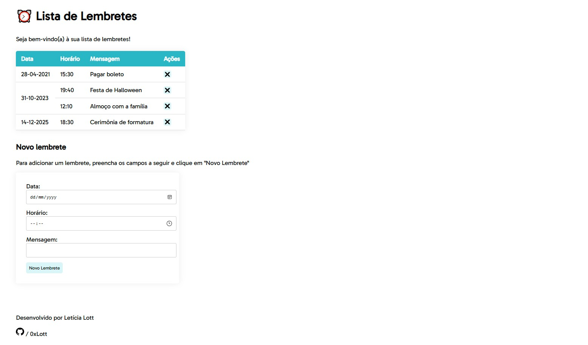

# Lista de Lembretes
Aplicativo web para gerenciamento de lembretes.

---
## Features
- ⏰ Criação e remoção de lembretes
- 💬 Mensagem no lembrete
- 💻 Visualização intuitiva, agrupando lembretes por data
- ✨ Interface simples e de fácil interação



---
## Projeto

### Premissas assumidas
Para desenvolvimento deste projeto, presumiu-se que aplicação se propõe a atender a usuários que valorizam a simplicidade e demandam ênfase nas funcionalidades essenciais de um gerenciador de lembretes, ou seja, a possibiliade e adicionar, remover e visualizar lembretes de forma rápida e objetiva — aspecto fundamental para o uso no cotidiano.

### Decisões de projeto
Visando estruturar a aplicação com base na interatividade com o usuário, optou-se por utilizar a arquitetura Model View Controller (MVC) oferecida pelo framework **Spring Boot**. Por meio dela, facilitou-se a implementação do fluxo de dados entre a interface de usuário e a camada de persistência.

A escolha da linguagem **Java**, além da opção de utilizar o Spring Boot, se deu em função da robustez oferecida pela linguagem, permitindo que o código atendesse aos princípios SOLID e às boas práticas da Engenharia de Software, valorizando, assim, a **modularidade**, a **coesão** e o **baixo acoplamento**.

Ademais, optou-se por desenvolver uma **aplicação web** pela facilidade de acesso e execução por parte do usuário.

---
## Instruções de execução

Para executar a aplicação localmente, siga os seguintes passos:

1. **Pré-requisitos:**
    - Certifique-se de que você possui o Java JDK instalado em sua máquina.

2. **Clone o Repositório:**
    - Abra um terminal e execute o seguinte comando para clonar o repositório:
      ```bash
      git clone https://github.com/0xLott/reminder-app
      ```
   - Alternativamente, você pode fazer download do projeto na página deste repositório no GitHub. Para isso, clique em `Code > Download ZIP`
   
3. **Navegue até a Pasta do Projeto:**
    - Vá para o diretório da aplicação Spring Boot usando o comando:
      ```bash
      cd reminder-app
      ```

4. **Execute a Aplicação:**
    - Para iniciar a aplicação, use o seguinte comando:
      ```bash
      ./mvnw spring-boot:run
      ```

5. **Acesse a Aplicação:**
    - Após a aplicação ser iniciada com sucesso, abra um navegador web e acesse a URL:
      ```http://localhost:8080```

    - Certifique-se de que a aplicação esteja em execução enquanto você a utiliza.


